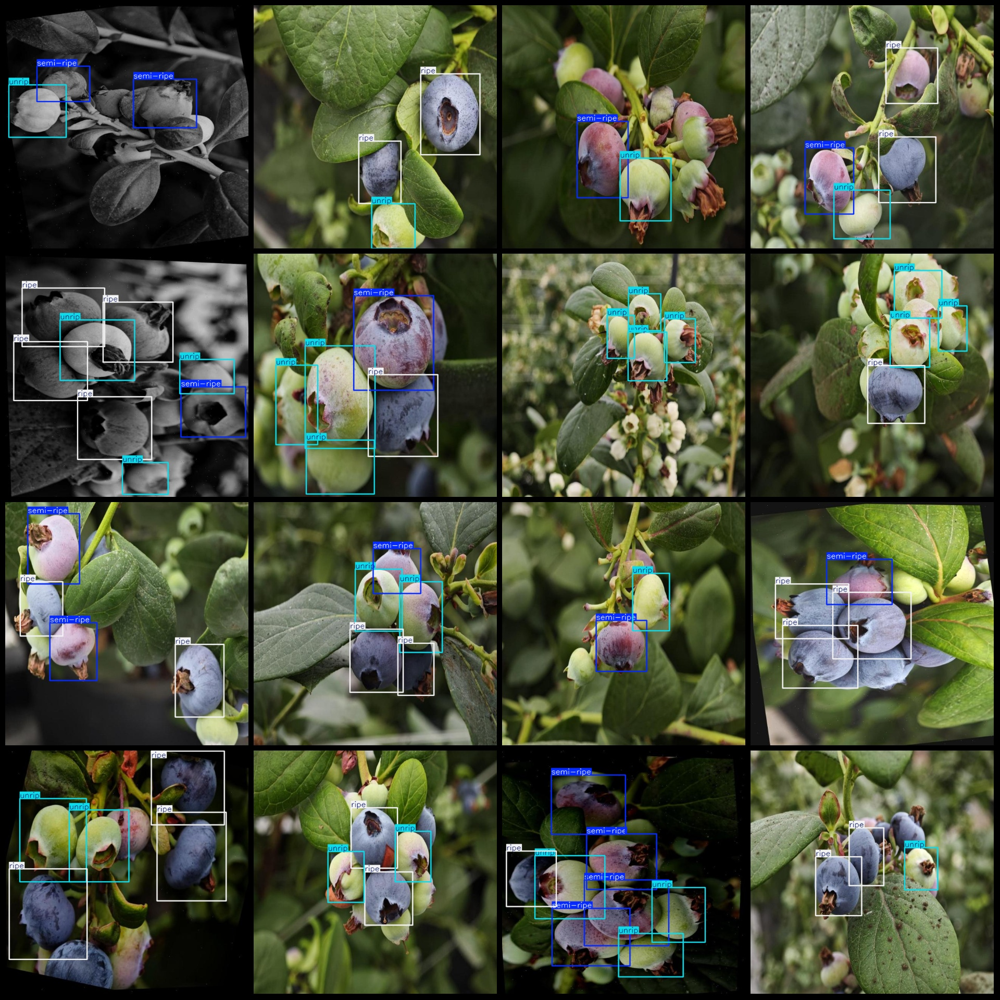
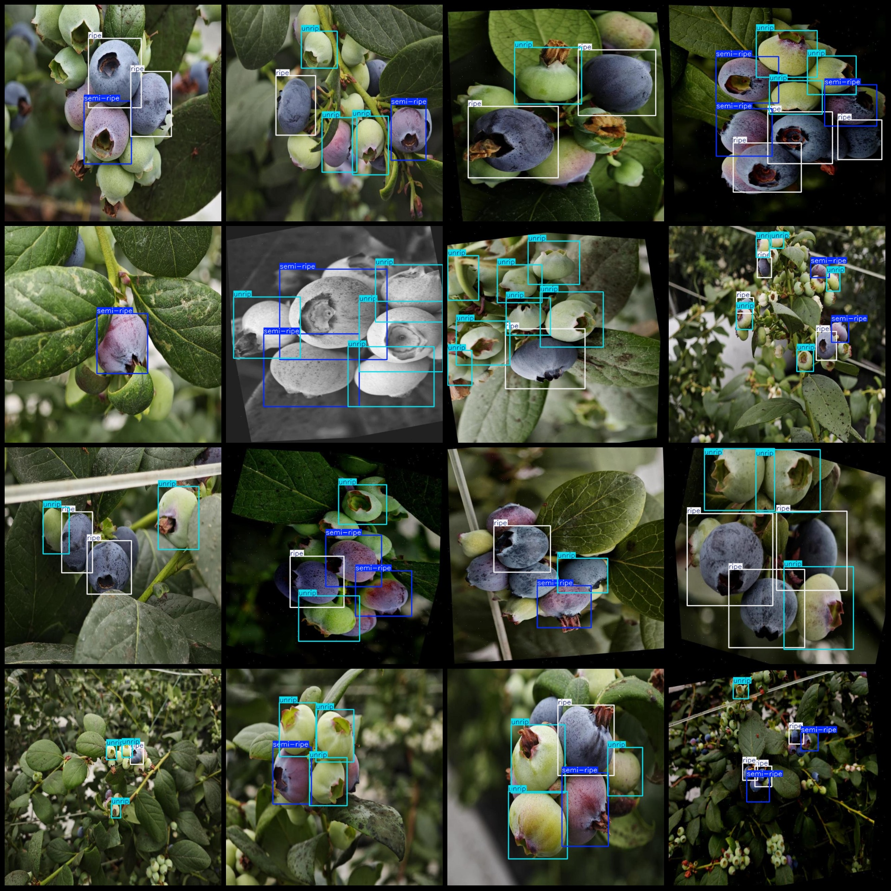

# Intelligent Agriculture Blueberry Maturity Detection Dataset VOC+YOLO Format with 926 Images and 3 Categories

Dataset format: Pascal VOC format + YOLO format (contains only jpg images, XML files, and txt files without the split path, instead of a txt file containing the split paths)
Number of images (jpg file count): 926
Number of annotations (xml file count): 926
Number of annotations (txt file count): 926
Number of annotation categories: 3
Annotation category names (note that the order in the yolo format is not consistent with this, but it corresponds to the labels folder's classes.txt): ["ripe", "semi-ripe", "unrip"]
Box counts for each category:
ripe (ripeness): 1928
semi-ripe (half ripeness): 1025
unrip (unripeness): 2573
Total boxes: 5526
Image resolution: 640x640
Annotation tool used: labelImg
Annotation rule: draw bounding boxes for categories
Important note: The dataset does not have partitioned training, validation, or test sets. Please partition them yourself.
Special declaration: This dataset does not guarantee the accuracy of the trained model or the weight files.
Image preview:
Annotation example:

## Images

Here is a pay link on Stripe ( https://buy.stripe.com/3cs8yP7sY87d0vu9AB ). Please contact me lonlonago@foxmail.com after funding $89, and I will send you a complete data files , thank you!

